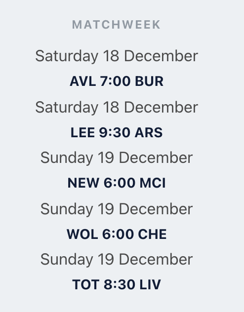

<h1>User Story </h1>
<p>To check on recent news, stats, and anything else about the premier league.</p>

<h1>Completed App </h1>


<h1> Installation Instructions </h1>
<ol>
    <li> Fork and clone the repository</li>
    <li> CD into premiere-league </li>
    <li> Run NPM Install </li>
    <li> Run NPM start </li>
</ol>

<h1>Components </h1>

<h2>Top Tab: </h2>


<h3> Code Snippet <h3>

```js
class TopTabs extends Component {
    constructor(props) {
        super(props);
    }

    render() {
        return (
            <a className="navbar-item" href={this.props.link}>
                {this.props.text}
            </a>
        );
    }
}
```
<h3> Code Snippet of Data</h3>

```js
const topTabList = [
    {
        text: 'Premier League',
        link: 'https://www.premierleague.com/'
    },
    {
        text: 'Fantasy',
        link: 'https://www.premierleague.com/fantasy'
    },
    {
        text: 'Videos',
        link: 'https://www.premierleague.com/video'
    },
    {
        text: 'Community',
        link: 'https://www.premierleague.com/communities'
    },
    {
        text: 'More',
        link: 'https://www.premierleague.com/stats'
    },
    {
        text: 'Sign In',
        link: 'https://users.premierleague.com/?redirect_uri=https://www.premierleague.com/&app=pl-web'
    },
]
```
<h3> Code Snippet of a Test </h3>

```js
test('renders dashboard tag', () => {
    render(<Admin />);
    const navbarElement = screen.getByText(/Sign In/);
    expect(navbarElement).toBeInTheDocument();
});
```

<h2>Second Tab: </h2>


<h2>MatchWeek: </h2>



<h2>Standings: </h2>


<h2>News: </h2>


<h1>NPM Tests</h1>


